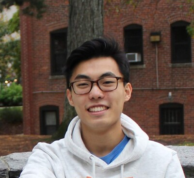
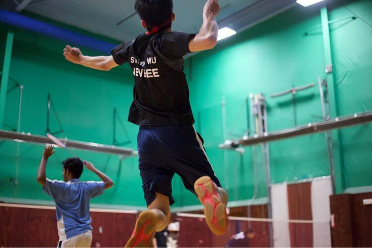
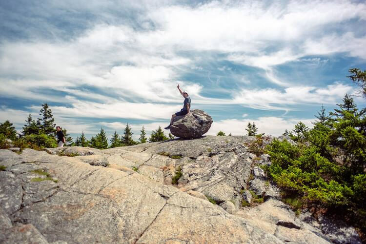

### More about me
I'm a current Computer Science major @ Northeastern University with a concentration in artificial intelligence. I aspire to be a machine learning researcher or data scientist, and I'm actively involved in adversarial machine learning research. 

<object data="http://yoursite.com/the.pdf" type="application/pdf" width="700px" height="700px">
    <embed src="http://yoursite.com/the.pdf">
        
This browser does not support PDFs. Please download the PDF to view it: <a href="http://yoursite.com/the.pdf">Download PDF</a>.

    </embed>
</object>

### Hobbies:
- Badminton
- Classical Music
- Boston Sports (Go Red Sox and Patriots!)
- Hiking 
- Discussing Academic Papers (An Image is Worth 16x16 Words anyone?)
- Video Games

While I was writing this, I thought it might be cool to write like a conversation. That way, it's more fun for me to write and hopefully more fun for you to read! Diving right into my hobbies: I love badminton, been playing since I was a kid (subtle flex but I was once top 20 in the Under 17 Category for Singles in the USA!). Here's a picture of me at a college badminton tournament. 

I also played the violin in high school, where I got very interested in classical music. Nothing beats playing with an orchestra at Symphony Hall! Some of my favorite composers are Mahler, Beethoven, and Dvorak. Recently, I've also realized just how fun and amazing hiking is. Below is a picture of me at Mount Monadnock!

