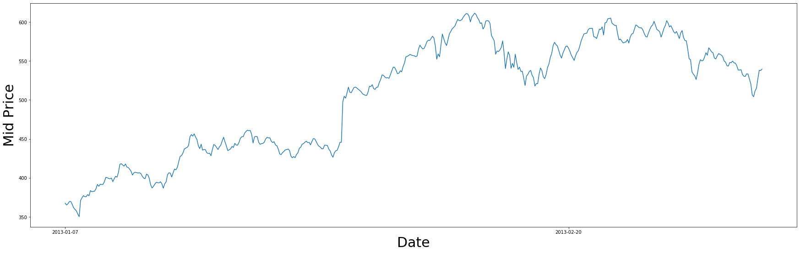
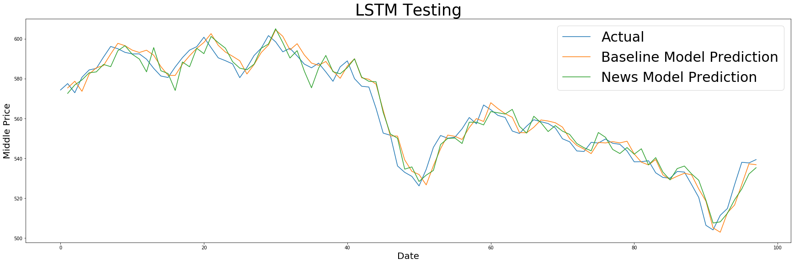
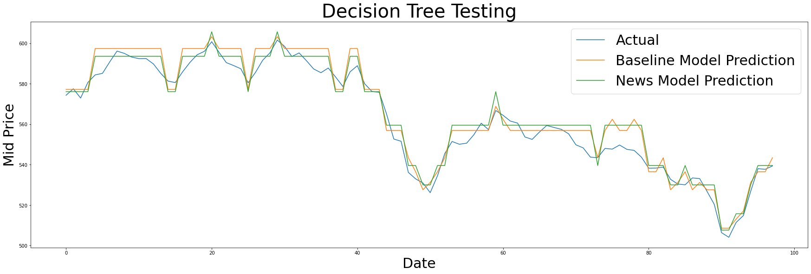
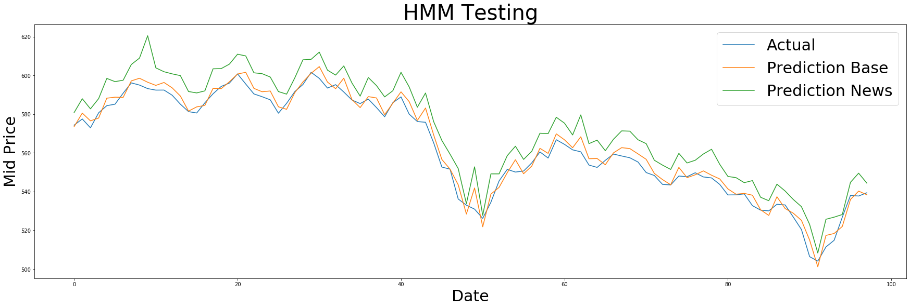

Usually I would follow what every english instructor in my life has told me: lead with a concise intro. But being the rebellious compsci major I am who has tried to escape all things english related (and failed miserably), I'm going to do something completely cliché to begin my first blog post and write a traditional introduction (thank you english teachers for the many years of practice). This is about a project that a group of friends and I did for our first "real" artificial intelligence class of college (to the fellow NEU students out there, the class is CS4100 and if he's still teaching, I highly recommend Kevin Gold). 

## Is the Stock Market Predictable?
Seems like a relatively straight forward question, and for anyone who's even remotely breathed in the direction of data science, this is (unsurprisingly) something a ***lot*** of people have attempted to answer. But with the latest developments in deep learning, this seems to be something that is potentially in reach. But there's something different about predicting the stock market, than classifying images of cute dogs. In one case, image classification is a problem that we have manually defined as a challenge for machine learning. We have carefully and manually curated a dataset of images specifically for the purpose of image classifications. And while there is absolutely nothing wrong with that (image classification has become an incredible powerful and important tool of the present), it makes predicting the stock market rather hard to put into ... should I say arrays? Maybe at first glance this might seem easy, and maybe it is. There's a lot of numbers in stock market information, shouldn't that be enough? Well, while the numbers themselves offer some sort of reflection of the stock's current state, it is so compressed and filtered value that maybe it offers no value at all whatsoever. One might even argue that something like news sentiment (whether or not the news that day was positive/negative) could offer a better insight into a stock market price's trend. Regardless, there's a massive amount of precious data out there that can potentially help predict stock market prices. But, Stanley, what are you trying to say with all of this? **This blog is here to present how we were able to effectively predict Google's stock market using three simple algorithms, albeit on a very small scale**

## Alphabet Inc. Class C
In total, [Kaggle](https://www.kaggle.com/borismarjanovic/price-volume-data-for-all-us-stocks-etfs) was able to give us around 500 days worth of Google's stock market price data that overlapped with news sentiment data we were able to pull from [OpenML](https://www.openml.org/d/4545). That's already a pretty small dataset, but we also maintained a roughly 60/20/20 train/val/test split, leaving us with roughly 300 consecutive training days, followed by 100 validation and 100 testing days. Even with this limited data, we were able to make some rather incredible discoveries.

## Maybe Stocks is a Piece of Cake?
We decided to go with three different machine learning algorithms, a classic LSTM (Long Short-term Memory), a Regression Decision Tree using Residual Squared Sums, and an HMM (Hidden Markov Model). The LSTM represented a standard time series forecasting RNN, while the decision tree and HMM were attempts to apply slighly different algorithms to the task of stock market prediction. Both the LSTM and decision tree were trained on data with a "look-back" of one day. That means the prediction of stock prices for the next day was mainly based on that of the previous day. We found that this approach gave us the best validation performance. The results on testing data are as followed:

